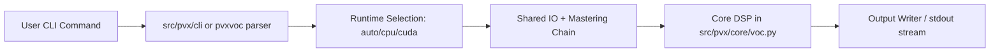
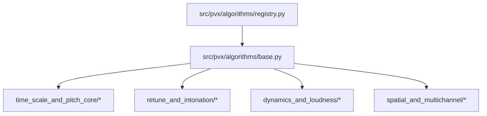
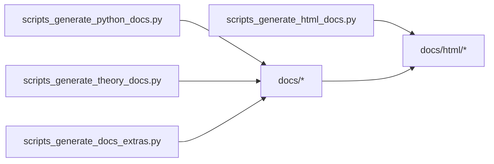
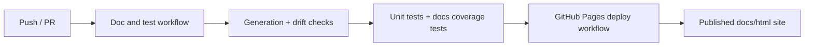

# pvx Architecture

_Generated from commit `23925ec` (commit date: 2026-02-17T16:15:08-05:00)._

System architecture for runtime processing, algorithm dispatch, and documentation pipelines.

## 1. Runtime and CLI Flow

## 2. Algorithm Registry and Dispatch

## 3. Documentation Build Graph

## 4. CI + Pages

