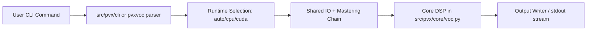
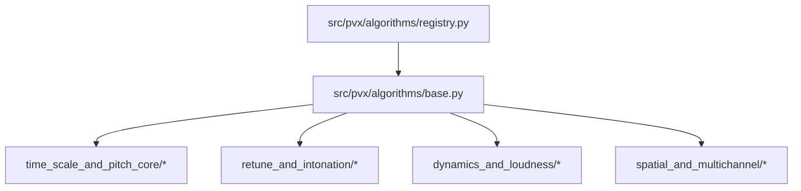
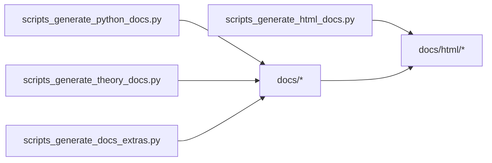
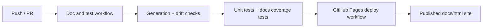

# pvx Architecture

_Generated from commit `b4bed85` (commit date: 2026-02-19T13:53:32-05:00)._

## Acronym Primer

- application programming interface (API)
- command-line interface (CLI)
- path environment variable (PATH)
- digital signal processing (DSP)
- short-time Fourier transform (STFT)
- inverse short-time Fourier transform (ISTFT)
- fast Fourier transform (FFT)
- discrete Fourier transform (DFT)
- central processing unit (CPU)
- graphics processing unit (GPU)
- Compute Unified Device Architecture (CUDA)
- comma-separated values (CSV)
- JavaScript Object Notation (JSON)
- HyperText Markup Language (HTML)
- Portable Document Format (PDF)
- continuous integration (CI)
- fundamental frequency (F0)
- waveform similarity overlap-add (WSOLA)
- input/output (I/O)
- root-mean-square (RMS)
- loudness units relative to full scale (LUFS)
- signal-to-noise ratio (SNR)

System architecture for runtime processing, algorithm dispatch, and documentation pipelines.

## 1. Runtime and CLI Flow

## 2. Algorithm Registry and Dispatch

## 3. Documentation Build Graph

## 4. CI + Pages

